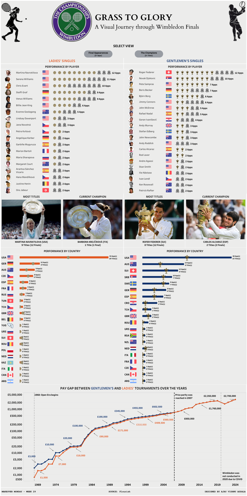

# Open Era Wimbledon Finals Dashboard

This Tableau dashboard provides a comprehensive analysis of the Open Era Wimbledon Finals, covering both Gentlemen's and Ladies' tournaments from 1968 to 2024. The dashboard includes details on champions, runners-up, countries, prize money, and more.

[View the Dashboard on Tableau Public](https://public.tableau.com/views/GrasstoGloryAvisualJourneythroughWimbledonFinalsintheOpenEraMOM2024Week29/WimbledonFinals?:language=en-US&:sid=&:redirect=auth&:display_count=n&:origin=viz_share_link)

## Features

### Select View
- **Final Appearances & Champions:** View all players with 2+ final appearances or 2+ titles.
- **Hover Feature:** Hover over players and trophies to see detailed stats, opponents, and scores in the finals.

### King and Queen of Wimbledon
- **Martina Navratilova & Roger Federer:** Highlighting their record 9 and 8 titles respectively, with both appearing in 12 finals.
- **Current Champions:** Featuring Carlos Alcaraz and Barbora Krejčíková as the 2024 champions.

### Country Analysis
- **Final Appearances & Titles by Country:** Analyzing the performance of countries, with the USA leading in both Gentlemen's and Ladies' formats.
- **Chart Type:** Utilized a [specific chart type] to represent country-wise performance. Feedback on this visualization is appreciated.

### Prize Money Analysis
- **Historical Pay Disparity:** Showing the significant difference in prize money over three decades.
- **Pay Parity Achieved:** Highlighting the equal pay milestone reached in 2007.

## Feedback
I would love to hear your feedback on the dashboard, especially regarding the chart type used for the country-wise performance. Is it effective, or could there be a better way to represent this data?

## Explore the Dashboard
Feel free to explore the dashboard and dive into the detailed analysis of Wimbledon Finals history.

